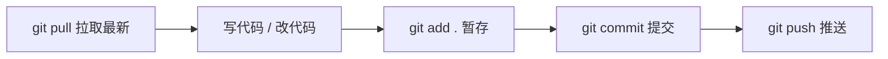

# GitHub 操作指引 —— 从零开始与同学协作

> 适用场景：数据库课程设计（DBCD）项目，多人协作开发。

---

## 目录

1. [前置准备](#1-前置准备)
2. [首次初始化：把项目上传到 GitHub](#2-首次初始化把项目上传到-github)
3. [队友克隆项目到本地](#3-队友克隆项目到本地)
4. [日常开发流程（核心！）](#4-日常开发流程核心)
5. [分支协作（推荐）](#5-分支协作推荐)
6. [冲突解决](#6-冲突解决)
7. [常用命令速查表](#7-常用命令速查表)
8. [常见问题 FAQ](#8-常见问题-faq)

---

## 1. 前置准备

### 1.1 安装 Git

- 下载地址：https://git-scm.com/download/win
- 安装时一路默认即可（**注意**：编辑器选择那步建议选 VS Code）
- 安装完后在任意文件夹右键，应该有 "Open Git Bash here"

### 1.2 配置用户信息

打开 Git Bash，执行（替换成你的信息）：

```bash
git config --global user.name "你的名字"
git config --global user.email "你的邮箱@example.com"
```

### 1.3 注册 GitHub 账号 & 创建仓库

1. 打开 https://github.com 注册账号
2. 登录后点击右上角 **+** → **New repository**
3. 填写仓库名（如 `DBCD`），选择 **Private**（课程项目建议私有）
4. **不要**勾选 "Add a README file"、"Add .gitignore"、"Choose a license"（我们已有项目文件）
5. 点击 **Create repository**，记下仓库地址，类似：
   ```
   https://github.com/你的用户名/DBCD.git
   ```

---

## 2. 首次初始化：把项目上传到 GitHub

> 以下操作在项目根目录 `e:\大三下课程\数据库\DBCD` 下进行。

### 2.1 创建 .gitignore 文件

在项目根目录新建 `.gitignore` 文件，内容如下（已针对本项目配置）：

```gitignore
# ===== Python =====
__pycache__/
*.py[cod]
*.pyo
*.egg-info/
.eggs/
dist/
*.egg
.venv/
venv/
env/

# ===== Node / Vue =====
frontend/node_modules/
frontend/dist/
frontend/.env.local

# ===== IDE =====
.vscode/
.idea/
*.swp
*.swo
*~

# ===== OS =====
Thumbs.db
Desktop.ini
.DS_Store

# ===== 敏感配置 =====
*.env
*.env.local
config.local.*

# ===== 临时文件 =====
*.log
*.tmp
~$*.docx
~$*.xlsx
```

### 2.2 初始化并推送

在项目根目录打开 Git Bash，依次执行：

```bash
# 1. 初始化 Git 仓库
git init

# 2. 添加所有文件到暂存区
git add .

# 3. 第一次提交
git commit -m "初始提交：数据库课程设计项目"

# 4. 关联远程仓库（替换成你的地址）
git remote add origin https://github.com/你的用户名/DBCD.git

# 5. 把 main 分支推送到 GitHub
git branch -M main
git push -u origin main
```

> **注意**：第 5 步会弹出 GitHub 登录窗口，用浏览器授权即可。

### 2.3 验证

刷新 GitHub 网页，应该能看到所有项目文件了。

---

## 3. 队友克隆项目到本地

队友在自己电脑上打开 Git Bash：

```bash
# 进入要存放项目的目录
cd ~/Desktop

# 克隆仓库
git clone https://github.com/你的用户名/DBCD.git

# 进入项目
cd DBCD
```

> **前提**：你已经在 GitHub 仓库的 **Settings → Collaborators** 里添加了队友的 GitHub 账号，否则队友没有 push 权限。

---

## 4. 日常开发流程（核心！）

**每天开始写代码前，永远先拉取最新代码！**



### 4.1 完整操作步骤

```bash
# === 每次开始工作前 ===

# 1. 拉取队友的最新代码
git pull

# === 写代码... ===

# === 完成一部分工作后 ===

# 2. 查看改了哪些文件
git status

# 3. 查看具体改了什么
git diff

# 4. 把改动添加到暂存区
git add .                    # 添加所有改动
# 或者只添加某个文件：
git add backend/database.py

# 5. 提交（附上有意义的说明）
git commit -m "新增：读者借阅查询接口"

# 6. 推送到 GitHub
git push
```

### 4.2 提交信息规范（建议）

| 前缀 | 含义 | 示例 |
|------|------|------|
| `新增：` | 新功能 | `新增：图书模糊搜索功能` |
| `修复：` | 修 bug | `修复：逾期罚款计算错误` |
| `优化：` | 改进已有代码 | `优化：数据库连接池配置` |
| `文档：` | 文档相关 | `文档：更新 API 接口说明` |
| `重构：` | 代码重构 | `重构：提取公共校验函数` |

### 4.3 一个好习惯

- **小步提交**：每完成一个小功能就 commit 一次，不要攒一整天
- **推送前先拉取**：`git pull` → 解决可能的冲突 → `git push`
- **不要提交能自动生成的文件**：`node_modules/`、`__pycache__/` 等（已在 .gitignore 中排除）

---

## 5. 分支协作（推荐）

当两个人可能同时改同一个模块时，用分支避免互相干扰。

### 5.1 工作流程

```
main ────●────●────●────●────  （主分支，保持稳定）
          \        /
feature-a  ●──●──●           （小明开发功能 A）
                       \
feature-b   ●────●────●      （小红开发功能 B）
```

### 5.2 具体操作

**每个人接到新任务时，从 main 创建自己的分支：**

```bash
# 1. 确保本地 main 是最新的
git checkout main
git pull

# 2. 创建并切换到新分支（用你的名字+功能命名）
git checkout -b xiaoming-book-search

# 3. 在这个分支上正常开发
git add .
git commit -m "新增：图书搜索接口"
git push -u origin xiaoming-book-search   # 第一次推送用 -u 关联
```

**开发完成后，在 GitHub 网页上合并：**

1. 打开 GitHub 仓库页面
2. 点击 **Pull requests** 标签
3. 点击 **New pull request**
4. base 选 `main`，compare 选你的分支 `xiaoming-book-search`
5. 点击 **Create pull request**
6. 让队友 **Review** 一下代码
7. 确认没问题后点击 **Merge pull request**
8. 合并后可以删除这个分支

**合并后，所有人更新本地 main：**

```bash
git checkout main
git pull
```

### 5.3 单人项目中也可以不用分支

如果团队人少且不同时改同一文件，直接在 main 上开发也完全可以：

```bash
git pull → 写代码 → git add . → git commit -m "..." → git push
```

---

## 6. 冲突解决

### 6.1 什么情况会冲突？

两个人**同时改了同一个文件的同一行**，Git 无法自动判断用谁的版本。

### 6.2 冲突长什么样？

```python
def calculate_fine(days):
<<<<<<< HEAD
    return days * 0.5   # 小明的版本：每天 0.5 元
=======
    return days * 1.0   # 小红的版本：每天 1.0 元
>>>>>>> origin/main
```

### 6.3 怎么解决？

1. 打开冲突文件，找到 `<<<<<<<`、`=======`、`>>>>>>>` 标记
2. 和队友**沟通**，决定保留哪个版本（或合并两者）
3. 手动编辑文件，删除冲突标记，保留最终想要的代码
4. 保存后执行：

```bash
git add .                          # 标记冲突已解决
git commit -m "解决合并冲突"        # 完成合并
git push
```

> **VS Code 用户提示**：VS Code 内置了冲突解决工具，会在冲突处显示按钮：
> - **Accept Current Change** — 保留自己的
> - **Accept Incoming Change** — 保留队友的
> - **Accept Both Changes** — 两个都保留
>
> 点按钮就行，不用手动删标记。

### 6.4 避免冲突的最佳实践

- **开始工作前先 `git pull`**
- **推送前先 `git pull`**
- **不同人负责不同文件/模块**
- **多沟通**：谁在改什么，群里说一声

---

## 7. 常用命令速查表

| 操作 | 命令 |
|------|------|
| 克隆仓库 | `git clone <仓库地址>` |
| 拉取最新代码 | `git pull` |
| 查看状态 | `git status` |
| 查看改动 | `git diff` |
| 添加所有改动 | `git add .` |
| 添加指定文件 | `git add <文件名>` |
| 提交 | `git commit -m "说明"` |
| 推送 | `git push` |
| 查看提交历史 | `git log --oneline` |
| 查看所有分支 | `git branch -a` |
| 切换分支 | `git checkout <分支名>` |
| 创建+切换分支 | `git checkout -b <新分支名>` |
| 撤销未 add 的改动 | `git checkout -- <文件名>` |
| 撤销 add 但未 commit | `git reset HEAD <文件名>` |
| 撤销最近的 commit | `git reset --soft HEAD~1` |
| 临时保存当前工作 | `git stash` |
| 恢复临时保存 | `git stash pop` |
| 查看远程地址 | `git remote -v` |

---

## 8. 常见问题 FAQ

### Q1：push 的时候报错 "failed to push some refs"

**原因**：GitHub 上有你没拉取的提交（队友推了新代码）。

**解决**：
```bash
git pull              # 先拉取
# 如果有冲突，解决冲突
git push              # 再推送
```

### Q2：不小心 commit 了不该提交的文件（如 node_modules）

**解决**：
```bash
# 1. 先把文件加入 .gitignore
echo "frontend/node_modules/" >> .gitignore

# 2. 从 Git 跟踪中移除（不删除本地文件）
git rm -r --cached frontend/node_modules/

# 3. 提交并推送
git add .gitignore
git commit -m "忽略 node_modules"
git push
```

### Q3：想回到之前某个版本看看

```bash
git log --oneline           # 查看提交历史，找到版本号（如 a1b2c3d）
git checkout a1b2c3d        # 临时切换到那个版本
# 看完后回到最新：
git checkout main
```

### Q4：commit 信息写错了想改

```bash
# 如果还没 push：
git commit --amend -m "新的提交信息"

# 如果已经 push 了：
# 不要改了，下次注意就行（改已推送的历史会给队友造成麻烦）
```

### Q5：队友改了数据库表结构，我 pull 后怎么同步？

**本项目特别说明**——数据库 SQL 文件在 `backend/sql/` 目录下：

```bash
git pull                              # 拉取最新 SQL 文件
# 然后在你的数据库中执行新的 SQL 文件
# （具体执行方式参考你们项目的数据库说明文档）
```

### Q6：GitHub 网页上怎么直接改文件？

- 打开文件 → 点击右上角铅笔图标 ✏️ → 编辑 → 点击 **Commit changes**
- **注意**：只适合改文档（如 README），代码文件建议在本地改

### Q7：怎么添加队友为协作者？

1. GitHub 仓库页面 → **Settings** → **Collaborators**
2. 点击 **Add people**
3. 输入队友的 GitHub 用户名或邮箱
4. 队友会收到邀请邮件，接受后就有 push 权限了

---

## 附录：本项目文件结构 & 协作分工建议

```
DBCD/
├── backend/                 # 后端（Python/FastAPI）
│   ├── routers/             # API 路由 —— 可按模块分工
│   ├── schemas/             # 数据模型
│   ├── sql/                 # 数据库 SQL 脚本
│   └── database.py          # 数据库连接
├── frontend/                # 前端（Vue）
│   └── src/
├── 设计方案与记录/           # 设计文档
├── 设计目标实现情况+项目实现说明书/  # 验收文档
├── .gitignore               # Git 忽略规则
└── GitHub操作指引.md         # 本文件
```

**建议分工**：
- 后端同学改 `backend/`，前端同学改 `frontend/`，文档同学改 `.md` 文件
- 这样改不同目录，几乎不会冲突
- SQL 文件只有一个人改，避免冲突

---

> **最后一条建议**：遇到问题先在群里问队友，不要自己瞎操作。`git push --force` 是核武器，**绝对不要用**（除非你非常清楚后果）。
